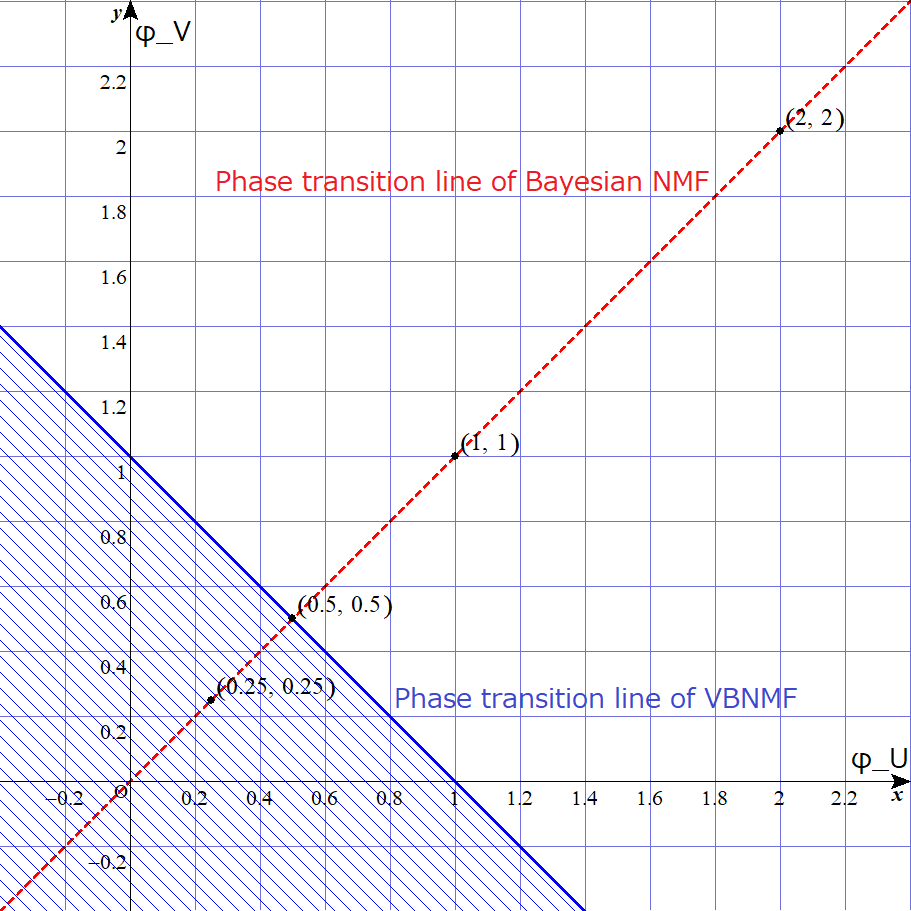

# LearningCoefficient-RLCT-ofNMF-usingGS

This is the numerical experimental `Julia 1.3.0` codes for calculating real log canonical threshold for non-negative matrix factorization (NMF) using Gibbs sampling.  This experiment had been carried out for [1].

## Environment

Here, I show my environment used for the experiment.

### Hardware and OS

* CPU: Intel(R) Core(TM) i7-7700 CPU @ 3.60GHz
* RAM: 16.0 GB
* OS: Windows 10 Home 64bit

### Software

* Julia version 1.3.0 (later versions are maybe available but they are not tested).

Moreover, I used the following packages:
```
  "PDMats"           => v"0.9.11"
  "Distributions"    => v"0.21.12"
  "StatsPlots"       => v"0.13.0"
  "IJulia"           => v"1.20.2"
  "ProgressMeter"    => v"1.2.0"
  "Gadfly"           => v"1.0.1"
  "StatsFuns"        => v"0.9.3"
  "SpecialFunctions" => v"0.9.0"
```

## Ensure

Numerical calculation for the real log canonical threshold (RLCT a.k.a. learning coefficient) of Bayesian NMF,
via the Bayesian generalization error and WAIC averaged overall simulations,
when the posterior distribution is realized by Gibbs sampling and the prior of the parameter matrix is a gamma distribution.

## Contents

* `README.md`: this file.
* `README-j.md`: the Japanese version of the README file.
* `Julia_calculate_RLCT_of_NMF_by_GS_NEUNET.ipynb`: the Jupyter Notebook file of the experiment code.
* `Julia_calculate_RLCT_of_NMF_by_GS_NEUNET.jl`: the Julia code file exported by the above ipynb file.
* `image/PhaseTrans-withdesc.png`: the following phase diagram of NMF.

## Theoretical Background

From the theoretical result [1], the RLCT depends on the hyperparamter and the lower bound of the variational approximation error drastically changes when the hyperparamter is changed (see also the following image). 



The phenomenon is called "phase transition" and the critical line is called "phase transition line". The exact phase transition line of variational Bayesian NMF (VBNMF) is clarified by Kohjima and Watanabe [2] (see the blue line); however, that of Bayesian NMF had not yet derived. Our paper has theoretically derived the upper bound of the RLCT and the lower bound of the variational approximation error with a phase transition line (see the red dashed line). The detail is in the markdown cells in the Jupyter notebook file `Julia_calculate_RLCT_of_NMF_by_GS_NEUNET.ipynb` and the paper [1]. This code is used for the experiment to verify the numerical behavior of our theorem. The black dots in the above diagram are the hyperparamters used in the paper.


## Reference

1. Naoki Hayashi. "Variational Approximation Error in Non-negative Matrix Factorization", Neural Networks, Volume 126, June 2020, pp.65-75. [doi: 10.1016/j.neunet.2020.03.009](https://doi.org/10.1016/j.neunet.2020.03.009). (2019/6/18 submitted. 2020/3/9 accepted. 2020/3/20 published on web). The arXiv version is [here, arXiv: 1809.02963](https://arxiv.org/abs/1809.02963).

2. Masahiro Kohjima and Sumio Watanabe. "Phase Transition Structure of Variational Bayesian Nonnegative Matrix Factorization", In: Lintas A., Rovetta S., Verschure P., Villa A. (eds) Artificial Neural Networks and Machine Learning – ICANN 2017. ICANN 2017. Lecture Notes in Computer Science, vol 10614. Springer, Cham. [doi: 10.1007/978-3-319-68612-7_17](https://https://doi.org/10.1007/978-3-319-68612-7_17)
